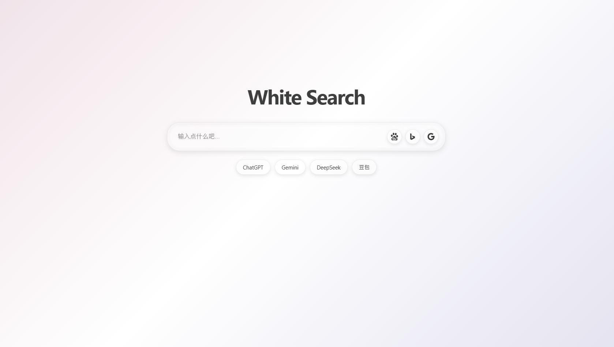
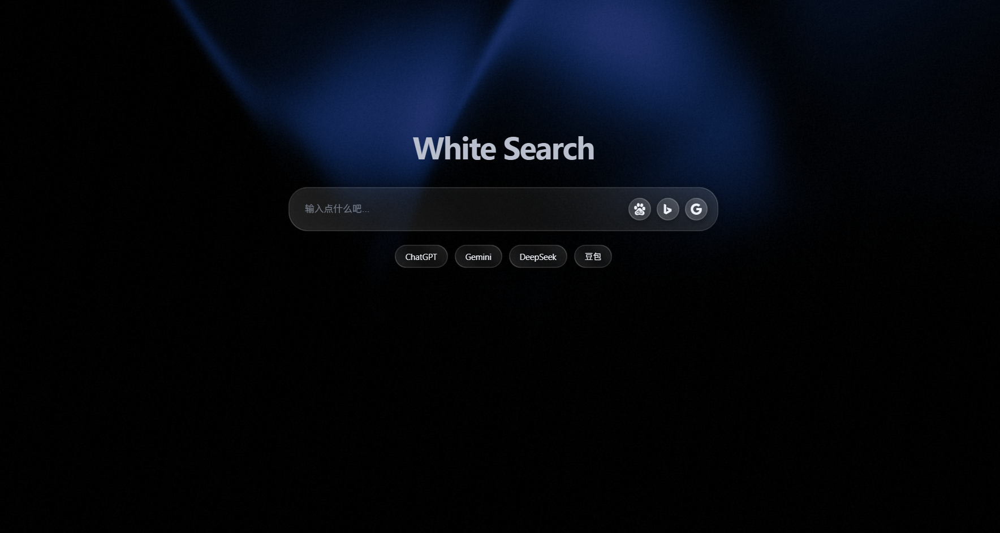
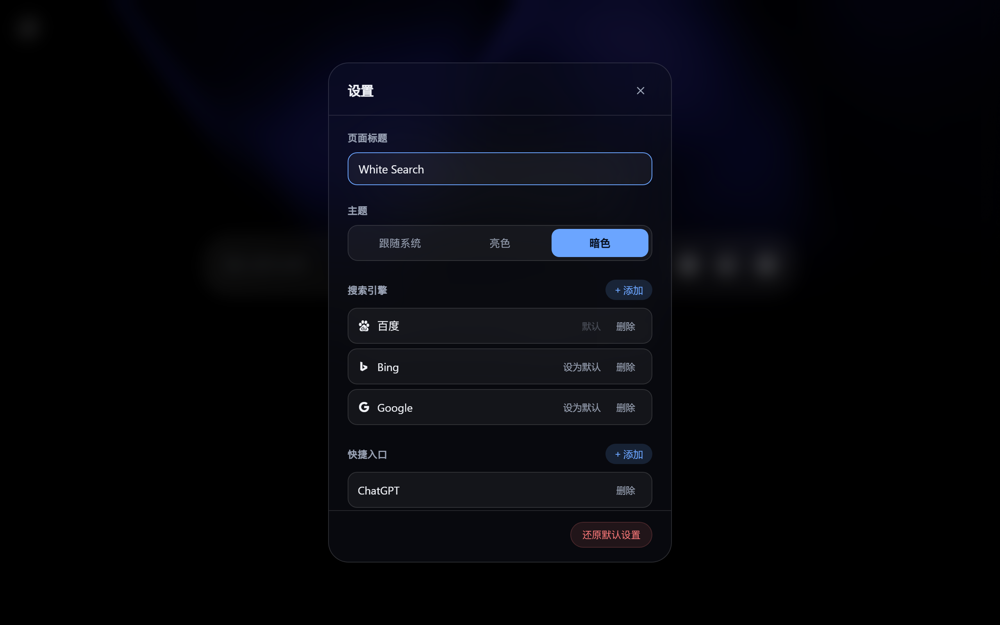

# White Search / 白搜 （搜索美化、聚合搜索）

起因是从 2026 年某天百度首页增加了一个无法手动关闭的信息流，
固诞生 White-Search，替换百度或必应用于浏览器首页，提供多引擎的一键搜索直达，并集成联想词建议以及常见 AI Chat 入口，整体采用液态玻璃风格。



暗色模式下背景为动态着色器动画，主辅色每次进入随机生成：



## 功能

**搜索**

- 回车跳转默认搜索引擎，引擎按钮一键切换重定向
- 联想词建议，支持键盘上下选择、回车直达、Esc 关闭
- 联想词来源自动跟随当前默认引擎（百度 / Bing / Google）

**设置面板**

鼠标移到页面左上角显示设置按钮，点击打开：

- 自定义页面标题
- 主题切换：跟随系统 / 亮色 / 暗色，首次进入默认读取系统值
- 自定义搜索引擎，可增删，最少 1 个最多 4 个
- 自定义快捷入口，需填写名称与域名，可增删，最少 0 个
- 一键还原默认设置



搜索引擎地址用 `%s` 代表关键词（与 Chrome / Firefox 自定义搜索引擎写法一致），例如：

```
https://duckduckgo.com/?q=%s
```

预置的百度、Bing、Google 使用内置图标，自定义引擎自动抓取网站 favicon，失败则回退为首字母头像。

**界面**

- 亮色 / 暗色两套完整配色
- 液态玻璃风格：低透明度填充 + 斜角高光 + 边缘折射
- 光标悬停时按钮与搜索框的描边跟随光标点亮
- 标题扫光动画
- 亮色模式每次进入生成随机渐变背景；暗色模式为动态着色器背景
- 响应式布局，适配移动端
- 尊重系统的「减弱动态效果」偏好设置

## 安装

### 方式一：浏览器扩展（推荐）

安装后自动替换新标签页。

1. 从 [Releases](../../releases) 下载 `white-search-<版本>.zip` 并解压
2. 打开 `chrome://extensions`（Edge 为 `edge://extensions`）
3. 打开右上角「开发者模式」
4. 点击「加载已解压的扩展程序」，选择解压后的文件夹

扩展形态下联想词通过 `fetch` 直接请求，需要 `host_permissions`（已在 `manifest.json` 中声明，仅限三个搜索引擎的联想接口域名）。

### 方式二：静态页面

直接打开 `index.html` 即可，或将其设为浏览器主页。此形态下联想词走 JSONP，无需任何权限。

### 自行打包扩展

```bash
node build-extension.js
```

产物为 `dist/white-search-<版本>.zip`，同时保留未压缩的 `dist/extension/` 供本地加载调试。

## 说明

- 项目为纯静态页面，无需安装依赖或启动服务，直接打开 `index.html` 即可
- 设置保存在浏览器 `localStorage`，仅存于本地，清除浏览器数据会一并清除
- 自定义引擎与快捷入口的图标通过第三方 favicon 服务获取，会向该服务发送对应域名

## 致谢

界面动效参考并移植自 [React Bits](https://reactbits.dev)，为保持项目零依赖，均已改写为原生 JavaScript / CSS 实现：

- **DarkVeil** — 暗色模式背景着色器
- **ShapeBlur** — 按钮与搜索框的光标跟随描边
- **ShinyText** — 标题扫光效果
